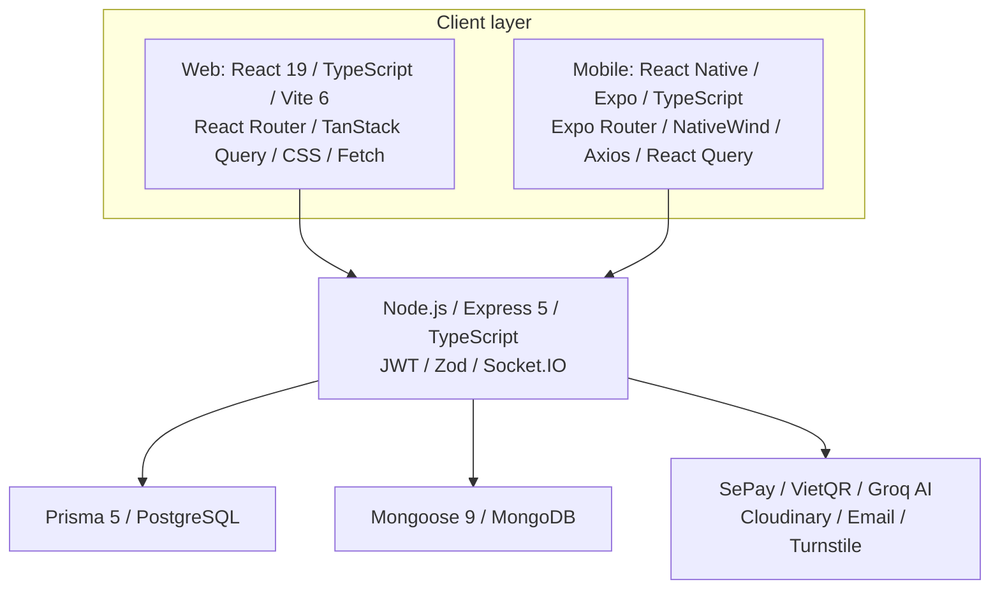
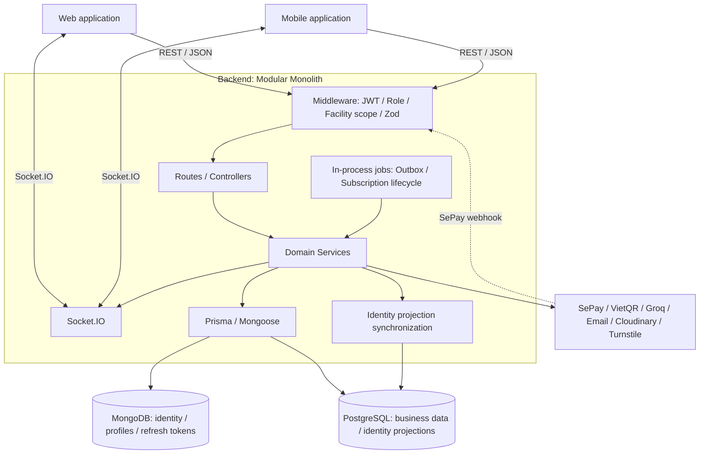
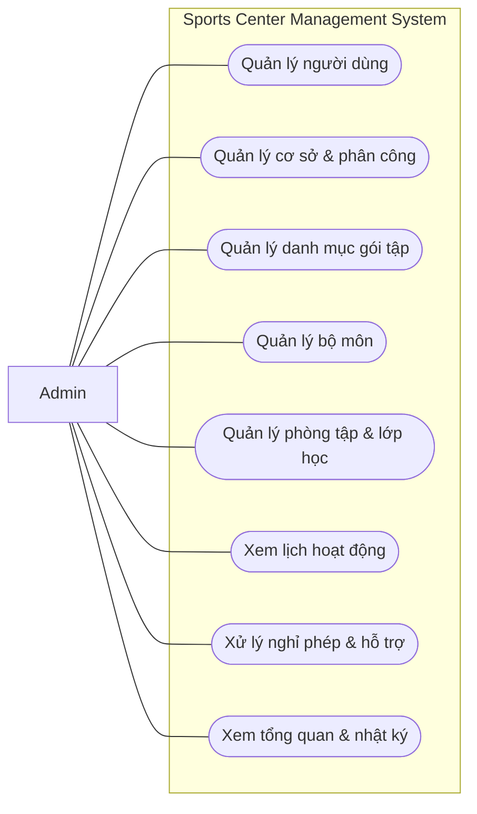
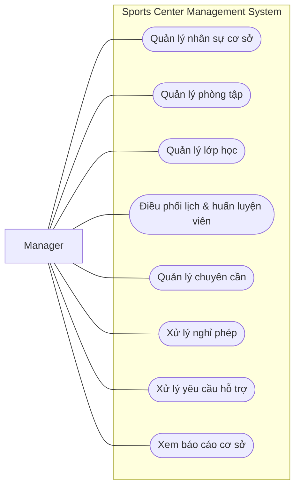
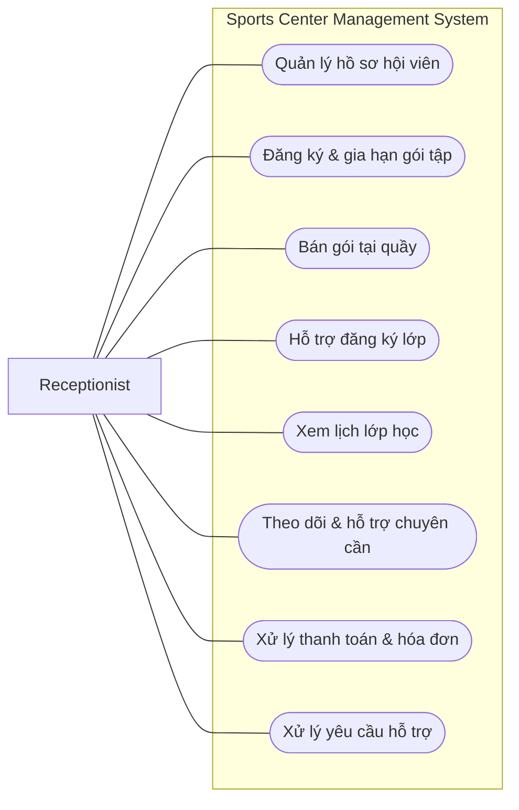
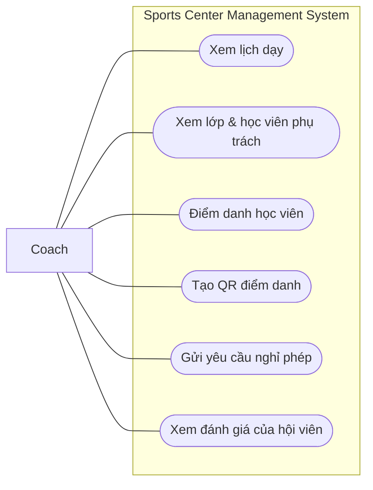
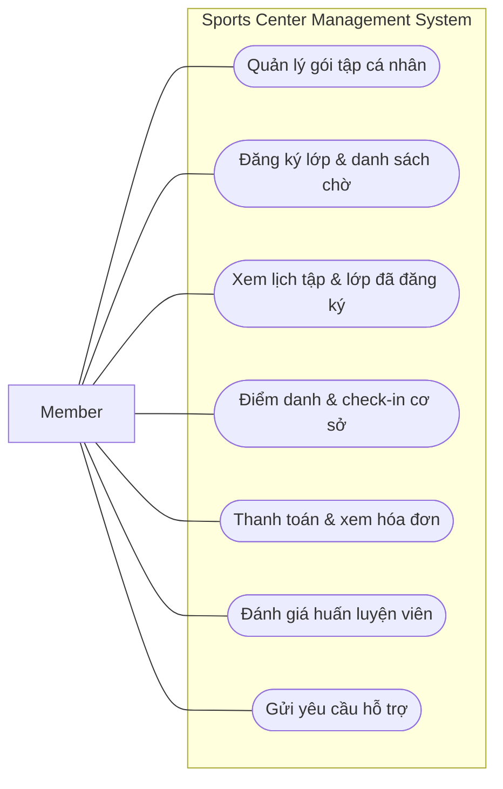
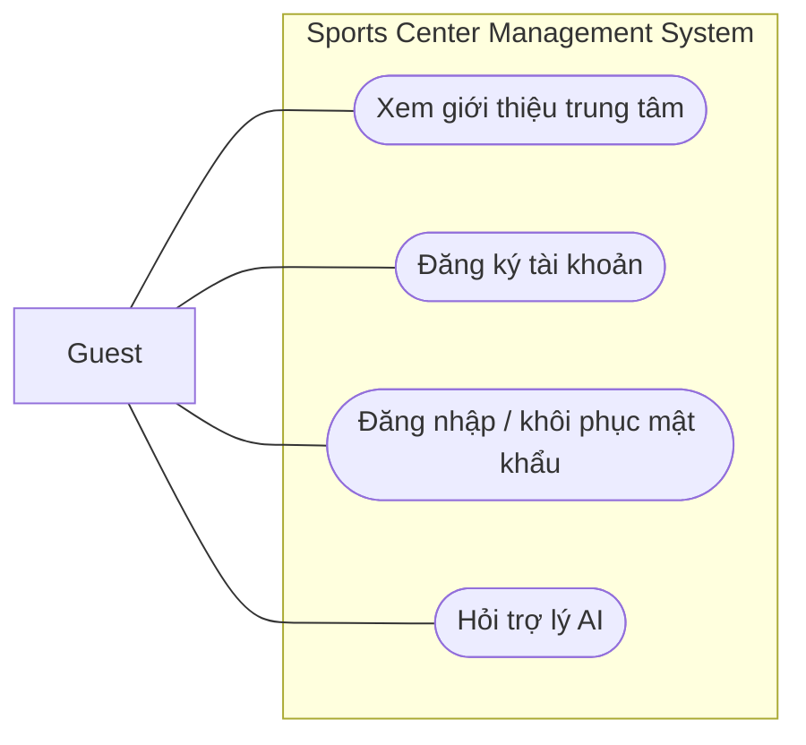

# Sơ đồ nguồn có thể chỉnh sửa

## Tech stack

```mermaid
flowchart TB
  subgraph CLIENT[Client layer]
    FE[Web: React 19 / TypeScript / Vite 6<br/>React Router / TanStack Query / CSS / Fetch]
    MB[Mobile: React Native / Expo / TypeScript<br/>Expo Router / NativeWind / Axios / React Query]
  end
  FE --> API[Node.js / Express 5 / TypeScript<br/>JWT / Zod / Socket.IO]
  MB --> API
  API --> SQL[Prisma 5 / PostgreSQL]
  API --> NOSQL[Mongoose 9 / MongoDB]
  API --> EXT[SePay / VietQR / Groq AI<br/>Cloudinary / Email / Turnstile]
```

## Architecture

```mermaid
flowchart TB
  W[Web application] -->|REST / JSON| R
  M[Mobile application] -->|REST / JSON| R
  W <-->|Socket.IO| RT
  M <-->|Socket.IO| RT
  subgraph BE[Backend: Modular Monolith]
    R[Middleware: JWT / Role / Facility scope / Zod] --> C[Routes / Controllers]
    C --> S[Domain Services]
    S --> P[Prisma / Mongoose]
    S --> RT[Socket.IO]
    J[In-process jobs: Outbox / Subscription lifecycle] --> S
    S --> SYNC[Identity projection synchronization]
  end
  P --> MG[(MongoDB: identity / profiles / refresh tokens)]
  P --> PG[(PostgreSQL: business data / identity projections)]
  SYNC --> PG
  S --> E[SePay / VietQR / Groq / Email / Cloudinary / Turnstile]
  E -. SePay webhook .-> R
```

## Admin

```mermaid
flowchart LR
  A["Admin"]
  subgraph SYS[Sports Center Management System]
    U0(["Quản lý người dùng"])
    U1(["Quản lý cơ sở & phân công"])
    U2(["Quản lý danh mục gói tập"])
    U3(["Quản lý bộ môn"])
    U4(["Quản lý phòng tập & lớp học"])
    U5(["Xem lịch hoạt động"])
    U6(["Xử lý nghỉ phép & hỗ trợ"])
    U7(["Xem tổng quan & nhật ký"])
  end
  A --- U0
  A --- U1
  A --- U2
  A --- U3
  A --- U4
  A --- U5
  A --- U6
  A --- U7
```

## Manager

```mermaid
flowchart LR
  A["Manager"]
  subgraph SYS[Sports Center Management System]
    U0(["Quản lý nhân sự cơ sở"])
    U1(["Quản lý phòng tập"])
    U2(["Quản lý lớp học"])
    U3(["Điều phối lịch & huấn luyện viên"])
    U4(["Quản lý chuyên cần"])
    U5(["Xử lý nghỉ phép"])
    U6(["Xử lý yêu cầu hỗ trợ"])
    U7(["Xem báo cáo cơ sở"])
  end
  A --- U0
  A --- U1
  A --- U2
  A --- U3
  A --- U4
  A --- U5
  A --- U6
  A --- U7
```

## Receptionist

```mermaid
flowchart LR
  A["Receptionist"]
  subgraph SYS[Sports Center Management System]
    U0(["Quản lý hồ sơ hội viên"])
    U1(["Đăng ký & gia hạn gói tập"])
    U2(["Bán gói tại quầy"])
    U3(["Hỗ trợ đăng ký lớp"])
    U4(["Xem lịch lớp học"])
    U5(["Theo dõi & hỗ trợ chuyên cần"])
    U6(["Xử lý thanh toán & hóa đơn"])
    U7(["Xử lý yêu cầu hỗ trợ"])
  end
  A --- U0
  A --- U1
  A --- U2
  A --- U3
  A --- U4
  A --- U5
  A --- U6
  A --- U7
```

## Coach

```mermaid
flowchart LR
  A["Coach"]
  subgraph SYS[Sports Center Management System]
    U0(["Xem lịch dạy"])
    U1(["Xem lớp & học viên phụ trách"])
    U2(["Điểm danh học viên"])
    U3(["Tạo QR điểm danh"])
    U4(["Gửi yêu cầu nghỉ phép"])
    U5(["Xem đánh giá của hội viên"])
  end
  A --- U0
  A --- U1
  A --- U2
  A --- U3
  A --- U4
  A --- U5
```

## Member

```mermaid
flowchart LR
  A["Member"]
  subgraph SYS[Sports Center Management System]
    U0(["Quản lý gói tập cá nhân"])
    U1(["Đăng ký lớp & danh sách chờ"])
    U2(["Xem lịch tập & lớp đã đăng ký"])
    U3(["Điểm danh & check-in cơ sở"])
    U4(["Thanh toán & xem hóa đơn"])
    U5(["Đánh giá huấn luyện viên"])
    U6(["Gửi yêu cầu hỗ trợ"])
  end
  A --- U0
  A --- U1
  A --- U2
  A --- U3
  A --- U4
  A --- U5
  A --- U6
```

## Guest

```mermaid
flowchart LR
  A["Guest"]
  subgraph SYS[Sports Center Management System]
    U0(["Xem giới thiệu trung tâm"])
    U1(["Đăng ký tài khoản"])
    U2(["Đăng nhập / khôi phục mật khẩu"])
    U3(["Hỏi trợ lý AI"])
  end
  A --- U0
  A --- U1
  A --- U2
  A --- U3
```
